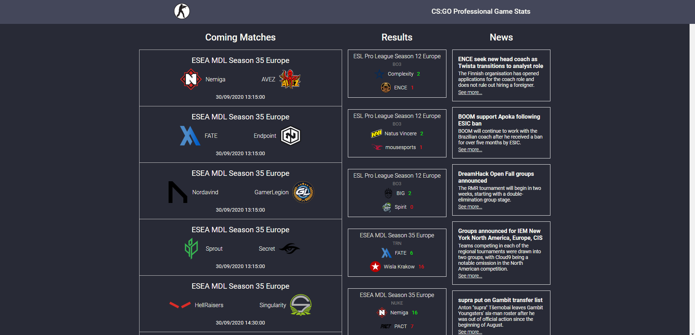

# CSGO Professional Game Stats

## <strong><i>Aplicação em desenvolvimento.</i>

### Para conseguir os dados atualizados das partidas, resultados e notícias, estou utilizando essa <a href="https://hltv-api.vercel.app/">API</a> com os dados da HLTV, principal site com estatísticas sobre CSGO.

 

## Andamento do projeto ↓

 

- [x] Obter dados da <a href="https://hltv-api.vercel.app/">API</a>
- [x] Selecionar dados para Próximas partidas, Resultados e Notícias
- [x] Dispor elementos na tela
- [] Responsividade
- [] Aprimorar UI (paleta de cores, efeitos de hover, focus)

 

## Problemas a serem resolvidos

 

Há partidas que não possuem imagem nem o nome dos times, isso acontece pois são casos em que a partida irá acontecer com times que dependem de outros resultados, partidas que não aconteceram ainda.

 

